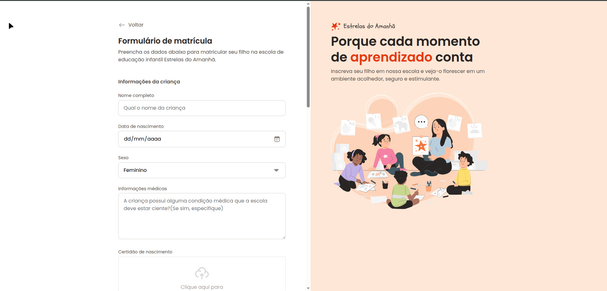

# 📝 Formulário de Matrícula - Estrelas do Amanhã

<p align="center">
  
  
</p>

## 💻 Sobre o Projeto

O **Estrelas do Amanhã** é um projeto de formulário de matrícula para uma escola de educação infantil. O objetivo principal foi desenvolver uma interface amigável, acessível e responsiva, explorando diversos tipos de campos de entrada (`inputs`), agrupamentos de dados (`fieldset`) e estilização avançada com CSS.

Este projeto faz parte do meu portfólio de estudos em desenvolvimento web Front-End.

---

## 🚀 Tecnologias Utilizadas

O projeto foi construído utilizando as seguintes tecnologias:

- **HTML5**: Estruturação semântica de dados.
- **CSS3**: Estilização, layout (Flexbox/Grid) e design responsivo.
- **Google Fonts**: Tipografia personalizada para melhor legibilidade.

---

## 🎨 Funcionalidades

- [x] Cadastro de informações do aluno.
- [x] Seleção de turno e série.
- [x] Upload de documentos.
- [x] Área para informações dos responsáveis.
- [x] Validação básica de campos obrigatórios.
- [x] Interface responsiva para dispositivos móveis.

---

## 📸 Demonstração

*(Dica: Adicione um print do seu projeto aqui para torná-lo mais visual)*

<p align="center">
  
</p>

---

## 🛠️ Como executar o projeto

1. Clone este repositório:
   ```bash
   git clone https://github.com/techedevborges/projeto_formulario-de-matricula.git